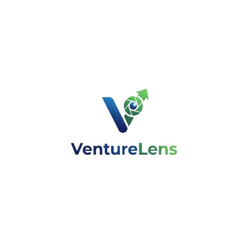

# VentureLens 🚀

<div align="center">



**AI-Powered Startup Idea Validator**

Validate your startup ideas instantly with AI-driven market analysis, competition insights, and monetization strategies.

[](https://opensource.org/licenses/MIT)
[](https://reactjs.org/)
[](https://nodejs.org/)
[](https://www.mongodb.com/)

[Demo](#demo) • [Features](#features) • [Installation](#installation) • [Usage](#usage) • [Tech Stack](#tech-stack)

</div>

---

## 📋 Table of Contents

- [About](#about)
- [Features](#features)
- [Demo](#demo)
- [Tech Stack](#tech-stack)
- [Installation](#installation)
- [Usage](#usage)
- [API Endpoints](#api-endpoints)
- [Project Structure](#project-structure)
- [Contributing](#contributing)
- [License](#license)

---

## 🎯 About

VentureLens is an AI-powered platform that helps entrepreneurs validate their startup ideas before investing time and resources. By leveraging advanced AI algorithms, it provides comprehensive analysis including market potential, competition level, monetization strategies, and actionable insights.

### Why VentureLens?

- ⚡ **Instant Analysis** - Get detailed feedback in under 30 seconds
- 🎯 **Data-Driven Insights** - AI-powered market and competition analysis
- 💰 **Monetization Ideas** - Discover revenue opportunities for your concept
- 📊 **Track Progress** - Save and manage all your ideas in one dashboard
- 📄 **Export Ready** - Generate professional pitch decks instantly

---

## ✨ Features

### Core Features

- **🤖 AI-Powered Analysis**
  - Market potential evaluation
  - Competition level scoring
  - Target audience identification
  - Monetization strategy suggestions

- **📊 Dashboard**
  - View all analyzed ideas
  - Track analysis history
  - Quick access to detailed reports
  - Statistics overview

- **💾 Idea Management**
  - Save ideas for future reference
  - Delete outdated concepts
  - View detailed analysis reports
  - Export capabilities

- **🔐 User Authentication**
  - Secure signup and login
  - JWT-based authentication
  - Protected routes
  - User profile management

- **🎨 Modern UI/UX**
  - Responsive design for all devices
  - Dark mode support
  - Smooth animations and transitions
  - Intuitive user interface

---

## 🖼️ Demo

### Home Page
Beautiful landing page with animated elements and clear value proposition.

### Analysis Page
Submit your startup idea and receive comprehensive AI analysis.

### Dashboard
Track all your ideas, view statistics, and manage your concepts.

### Detailed View
Deep dive into each analysis with formatted markdown reports.

---

## 🛠️ Tech Stack

### Frontend
- **React 18** - UI library
- **React Router DOM** - Client-side routing
- **Tailwind CSS** - Utility-first styling
- **Lucide React** - Modern icon library
- **React Icons** - Additional icon sets
- **React Markdown** - Markdown rendering
- **React Hot Toast** - Elegant notifications

### Backend
- **Node.js** - Runtime environment
- **Express.js** - Web framework
- **MongoDB** - Database
- **Mongoose** - ODM for MongoDB
- **JWT** - Authentication
- **bcrypt** - Password hashing

### AI Integration
- AI API for idea analysis (configure your preferred AI service)

---

## 📦 Installation

### Prerequisites

- Node.js (v18 or higher)
- MongoDB (v4 or higher)
- npm or yarn package manager

### Clone the Repository

```bash
git clone https://github.com/yourusername/venturelens.git
cd venturelens
```

### Backend Setup

1. Navigate to the server directory:
```bash
cd server
```

2. Install dependencies:
```bash
npm install
```

3. Create a `.env` file:
```env
PORT=5000
MONGO_URI=your_mongodb_connection_string
JWT_SECRET=your_jwt_secret_key
AI_API_KEY=your_ai_api_key
```

4. Start the server:
```bash
npm start
# or for development with nodemon
npm run dev
```

### Frontend Setup

1. Navigate to the client directory:
```bash
cd client
```

2. Install dependencies:
```bash
npm install
```

3. Create a `.env` file:
```env
VITE_API_URL=http://localhost:5000/api
```

4. Start the development server:
```bash
npm run dev
```

The application should now be running at `http://localhost:5173`

---

## 🚀 Usage

### 1. Sign Up / Login
Create an account or log in to access the platform.

### 2. Analyze Your Idea
- Navigate to the "Analyze Idea" page
- Enter your startup concept (up to 1000 characters)
- Click "Analyze My Idea"
- Wait for the AI to process your submission

### 3. Review Results
- Read through the comprehensive analysis
- Check market potential scores
- Review competition insights
- Explore monetization strategies

### 4. Save and Track
- Save ideas you want to revisit
- View all saved ideas in your dashboard
- Compare different concepts
- Delete outdated ideas

---

## 🔌 API Endpoints

### Authentication

```
POST /api/auth/signup    - Register new user
POST /api/auth/login     - Login user
```

### Ideas

```
GET    /api/ideas          - Get all user ideas
POST   /api/ideas/analyze  - Analyze new idea
GET    /api/ideas/:id      - Get specific idea
DELETE /api/ideas/:id      - Delete idea
```

---

## 📁 Project Structure

```
venturelens/
├── client/                 # Frontend React application
│   ├── public/            # Static assets
│   ├── src/
│   │   ├── components/    # React components
│   │   │   ├── analyze/   # Analysis-related components
│   │   │   ├── dashboard/ # Dashboard components
│   │   │   └── home/      # Home page components
│   │   ├── context/       # React context (Auth)
│   │   ├── pages/         # Page components
│   │   ├── utils/         # Utility functions
│   │   └── App.jsx        # Main app component
│   └── package.json
│
├── server/                # Backend Node.js application
│   ├── controllers/       # Route controllers
│   ├── models/           # MongoDB models
│   ├── routes/           # API routes
│   ├── middleware/       # Custom middleware
│   └── server.js         # Entry point
│
└── README.md
```

---

## 🎨 Component Overview

### Key Components

- **Navbar** - Navigation with authentication state
- **Footer** - Site footer with links and branding
- **Hero** - Landing page hero section
- **Features** - Feature showcase section
- **HowItWorks** - Step-by-step process explanation
- **CTASection** - Call-to-action section
- **IdeaForm** - Idea submission form
- **IdeaResult** - Analysis results display
- **DashboardStats** - Dashboard statistics
- **IdeaCard** - Individual idea card
- **ProtectedRoute** - Route protection wrapper

---

## 🔒 Authentication Flow

1. User signs up with name, email, and password
2. Password is hashed using bcrypt
3. User data is stored in MongoDB
4. On login, JWT token is generated
5. Token is stored in localStorage
6. Token is sent with each authenticated request
7. Protected routes verify token before access

---

## 🤝 Contributing

Contributions are welcome! Please follow these steps:

1. Fork the repository
2. Create a feature branch (`git checkout -b feature/AmazingFeature`)
3. Commit your changes (`git commit -m 'Add some AmazingFeature'`)
4. Push to the branch (`git push origin feature/AmazingFeature`)
5. Open a Pull Request

### Coding Standards

- Follow ESLint configuration
- Use meaningful variable and function names
- Comment complex logic
- Write clean, readable code
- Test your changes thoroughly

---

## 📝 License

This project is licensed under the MIT License - see the [LICENSE](LICENSE) file for details.

---

## 👥 Authors

- **Your Name** - *Initial work* - [YourGitHub](https://github.com/yourusername)

---

## 🙏 Acknowledgments

- React community for excellent documentation
- Tailwind CSS for the utility-first framework
- Lucide for beautiful icons
- All contributors and supporters

---

---

## 🗺️ Roadmap

- [ ] PDF pitch deck generation
- [ ] Advanced analytics dashboard
- [ ] Collaboration features
- [ ] Idea versioning
- [ ] Social sharing capabilities
- [ ] Mobile app (React Native)
- [ ] Integration with business tools
- [ ] Multi-language support

---

<div align="center">

**Made with ❤️ for entrepreneurs**

⭐ Star this repo if you find it helpful!

</div>
